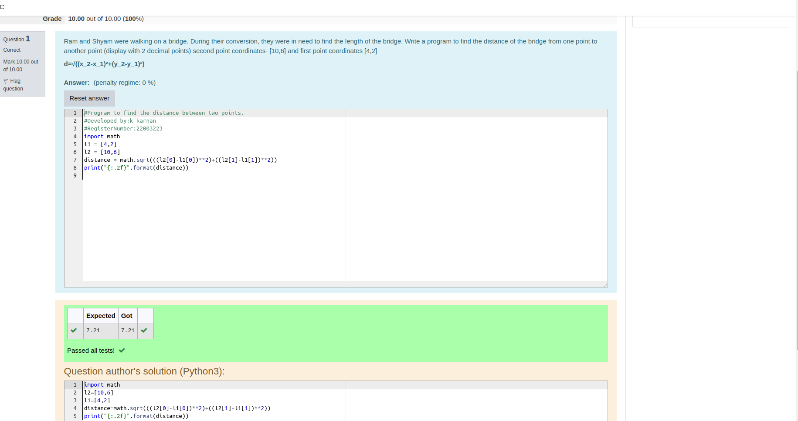

# DISTANCE-BETWEEN-TWO-POINTS

## AIM:
To write a python program to find the distance two 2 points
## ALGORITHM:
### Step 1: 
import math
### Step 2: 
Substitute the values in the distance formula  
### Step 3: 
end the program
### PROGRAM:
```python
#Program to find the distance between two points.
#Developed by:k karnan 
#RegisterNumber:22003223
import math 
l1 = [4,2]
l2 = [10,6]
distance = math.sqrt(((l2[0]-l1[0])**2)+((l2[1]-l1[1])**2))
print("{:.2f}".format(distance))
```
### OUTPUT:


### RESULT:
thus the distance between two points are successfully executed